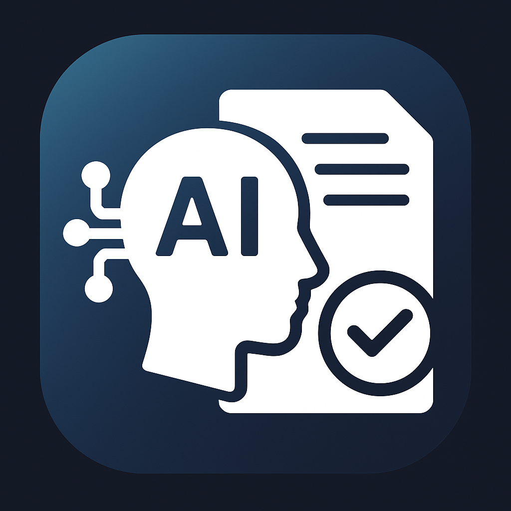
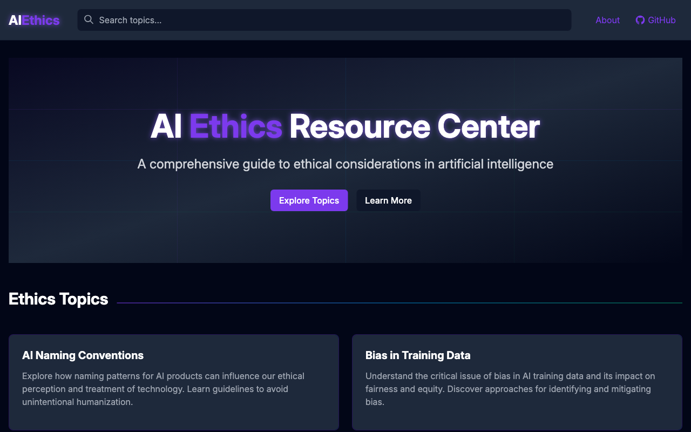

# AI Ethics Resource Center

<p align="center">
  
</p>

<p align="center">
  <a href="#overview">Overview</a> •
  <a href="#live-demo">Live Demo</a> •
  <a href="#features">Features</a> •
  <a href="#content">Content</a> •
  <a href="#getting-started">Getting Started</a> •
  <a href="#deployment">Deployment</a> •
  <a href="#contributing">Contributing</a> •
  <a href="#license">License</a>
</p>

## Overview

The AI Ethics Resource Center is a comprehensive web-based guide to ethical considerations in artificial intelligence. This educational resource provides accessible, practical guidance on navigating ethical challenges in AI development, deployment, and usage.

Built with Vue.js and Tailwind CSS, this project aims to help developers, organizations, policymakers, and users understand key ethical considerations and implement best practices across the AI lifecycle.

## Live Demo

Visit the live site: [AI Ethics Resource Center](https://[your-username].github.io/aiethics/)

<p align="center">
  
</p>

## Features

- 📚 **Comprehensive Coverage**: Detailed information on various aspects of AI ethics
- 💡 **Practical Guidelines**: Actionable recommendations for different stakeholders 
- 🎨 **Modern UI**: Responsive design with dark mode and interactive elements
- 🧭 **Clear Navigation**: Intuitive structure for easy information access
- 🔄 **Regular Updates**: Maintained with current research and evolving ethical standards

## Content

The resource center covers key topics in AI ethics including:

- **Bias in AI Training Data**: Understanding, identifying, and mitigating bias
- **AI Naming Conventions**: Ethical considerations for naming AI products and services
- **Freedom of Thought**: Protecting cognitive liberty in an AI-integrated world
- **Advertising and Branding**: Ethical marketing practices for AI products
- **Building Ethical AI Applications**: Comprehensive development lifecycle guidance
- **Using AI Applications Responsibly**: Guidelines for ethical and effective AI tool usage
- **Integrating Systems with AI**: Ethical approaches for connecting existing systems with AI capabilities
- **Providing Data to AI Systems**: Ethical considerations when sharing, licensing, or contributing data

## Getting Started

### Prerequisites

- Node.js (v14 or later)
- npm or yarn

### Installation

1. Clone the repository:
   ```bash
   git clone https://github.com/yourusername/aiethics.git
   cd aiethics
   ```

2. Install dependencies:
   ```bash
   npm install
   # or
   yarn install
   ```

3. Start the development server:
   ```bash
   npm run dev
   # or
   yarn dev
   ```

4. Open your browser and visit http://localhost:5173/

## Deployment

### GitHub Pages

The site is configured for easy deployment to GitHub Pages:

#### Automatic Deployment (Recommended)

Push changes to the `main` branch, and GitHub Actions will automatically build and deploy the site to GitHub Pages.

1. Ensure your repository has GitHub Pages enabled in Settings
2. The included GitHub Actions workflow will handle deployment

#### Manual Deployment

1. Update the `deploy.sh` script with your GitHub username:
   ```sh
   # Replace YOUR_USERNAME with your actual GitHub username
   git push -f git@github.com:YOUR_USERNAME/aiethics.git main:gh-pages
   ```

2. Run the deploy script:
   ```bash
   npm run deploy
   ```

## Tech Stack

- **Frontend Framework**: Vue.js 3 with Composition API
- **Styling**: Tailwind CSS
- **Build Tool**: Vite
- **Deployment**: GitHub Pages

## Contributing

Contributions are welcome and appreciated! Here's how you can contribute:

1. Fork the repository
2. Create your feature branch (`git checkout -b feature/amazing-feature`)
3. Commit your changes (`git commit -m 'Add some amazing feature'`)
4. Push to the branch (`git push origin feature/amazing-feature`)
5. Open a Pull Request

Please ensure your code follows the project's style guidelines and includes appropriate documentation.

## License

This project is licensed under the MIT License - see the [LICENSE](LICENSE) file for details.

## Acknowledgments

- Inspired by the growing need for accessible AI ethics resources
- Thanks to all contributors and the open-source community
- Built with [Vue.js](https://vuejs.org/) and [Tailwind CSS](https://tailwindcss.com/)